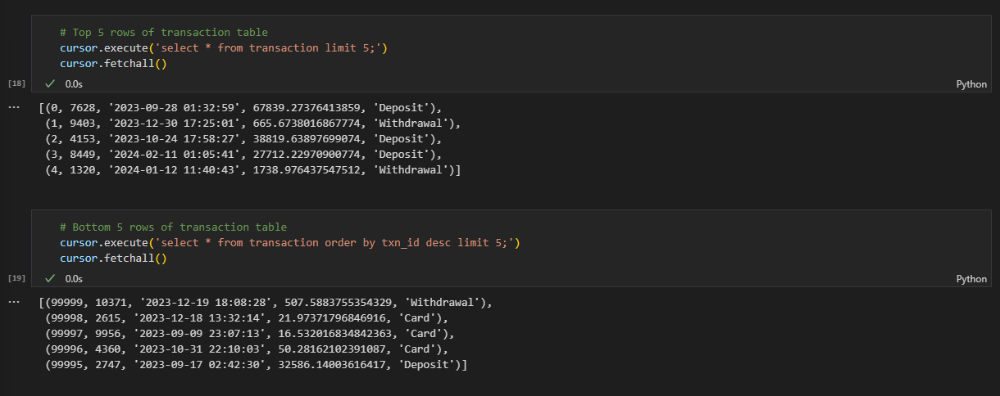
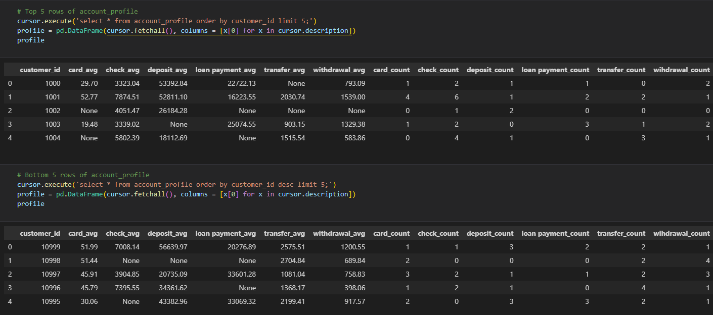

# Valley Financial Institution Analytics Project

## Overview
This project was undertaken as part of the Analytics Engineer Take Home Assessment for Valley Financial Institution. The main objective was to analyze customer behavior and transaction patterns to segment customers effectively, using demographic data and transaction details.

## Data Source
1. **Transaction DataMart**: Includes transaction amount, timestamp, customer ID, and transaction type.
2. **Customer Data**: Provides demographic information such as age, gender, profession, work experience, and family size.
3. **BLS Statistics**: Annual Median Wages data from the U.S. Bureau of Labor Statistics.

## Task 1
The first task was to create a data pipeline to ingest the data from the provided CSV files and Excel file into SQL database. The data pipeline was created using Python and MySQL Database. The [database_creation.ipynb](/task_1/database_creation.ipynb) notebook contains the code to create the database and tables, and ingest the data into the tables.

During the data ingestion process, the following steps were performed:

1. **Database Creation and Initialization**: The database was created using the `mysql.connector` library. The tables were created using the `pandas` library. 
   
2. **Data Extraction**: The data was extracted from the CSV and Excel files using the `pandas` library.
   
3. **Data Transformation**: The data was transformed to ensure consistency and integrity. Every dataframe was checked for missing values, duplicates, and data types. The data was cleaned and transformed as required. The customer and transaction data will checked for duplicates and missing values. For the BLS data, the Field Description column gives some information about meaning of some special characters in the data. The data was cleaned and transformed as required. The duplicate rows with same `OCC_CODE` will be checked and removed. The missing numerical values will not be imputed. The missing value imputation and normalization will be handled at the data analysis stage. The table in the SQL database will be kept as raw as possible. By the description in the Field Description column, the `*` indicate that a wage estimate is not available, `**` indicates that an employment estimate is not available, and `#` indicates a wage equal to or greater than $115.00 per hour or $239,200 per year. The cell value with the special characters of `*` and `**` will be record as `NaN` and the cell value with the special character of `#` will be record as $115.00 per hour or $239,200 per year.
   
4. **Combine Customer Data and BLS Data**: The customer data and BLS data were combined using the `pandas` library. The `OCC_CODE` column in the customer data was matched with the `OCC_CODE` column in the BLS data to get the annual median wage for each customer. The combined data was then loaded into the `customer` table in the SQL database though the `sql_connector` library.
   
5. **Data Loading and Relationship Creation**: The data was loaded into the tables using the `to_sql` method of the `pandas` library. The relationships between the tables were created using foreign keys.
   
6. **Data Validation**: The data was validated to ensure that the data was loaded correctly and the tables were populated.

## Task 2 - Stored Procedure Development
The second task was to create a stored procedure to calculate the average and count of transaction amount per transaction type for each customer. Then a trigger was created to execute the stored procedure whenever a new transaction is added to the transaction table. The stored procedure was created using MySQL and Python. The [stored_procedure.ipynb](/task_2/stored_procedure.ipynb) notebook contains the code to create and test the stored procedure and trigger. The [task2.sql](/task_2/task2.sql) file contains the SQL code for the stored procedure and trigger.


## Task 3 - Customer Segmentation
The third task was to perform clustering analysis on the customer data to segment customers effectively. The clustering analysis was performed using K-Means, HDBSCAN, and OPTICS clustering algorithms. The data cleaning and preprocessing will join available data from the customer, transaction, and BLS tables. The exploratory data analysis will be performed to understand the data distribution and relationships. The clustering analysis will be performed using the K-Means, HDBSCAN, and OPTICS algorithms. The evaluation metrics will be used to evaluate the clustering results.The [customer_segmentation.ipynb](task_3\customer_segementation.ipynb)  notebook contains the code for data cleaning, exploratory data analysis, clustering analysis, and evaluation metrics.

## Deliverables
### Screenshots of tables in MySQL Database
1. **Customer Table**: 
   
   

2. **Transaction Table**:

   
3. **BLS Table**:

    

4. **Account Profile Table**:

    

### SQL Scripts for Stored Procedure and Trigger
The development and testing of the stored procedure and trigger was done in the [stored_procedure.ipynb](/task_2/stored_procedure.ipynb) notebook. The SQL script for the stored procedure and trigger is as follows:
1. **Stored Procedure**: The SQL script for the stored procedure to calculate the average and count of transaction amount per transaction type for each customer is available in the [task2.sql](/task_2/task2.sql) file. The stored procedure will insert the calculated values into the `account_profile` table. If a customer already exists in the `account_profile` table, the stored procedure will update the values for that customer.
```sql
CREATE PROCEDURE account_Profile()
    BEGIN
        INSERT INTO account_profile
            select
                customer_id,
                ROUND(AVG(case when transaction_type = 'Card' then amount end), 2) as card_avg,
                ROUND(AVG(case when transaction_type = 'Check' then amount end), 2) as check_avg,
                ROUND(AVG(case when transaction_type = 'Deposit' then amount end), 2) as Deposit_avg,
                ROUND(AVG(case when transaction_type = 'Loan Payment' then amount end), 2) as `Loan Payment_avg`,
                ROUND(AVG(case when transaction_type = 'Transfer' then amount end), 2) as Transfer_avg,
                ROUND(AVG(case when transaction_type = 'Withdrawal' then amount end), 2) as Withdrawal_avg,
                SUM(case when transaction_type = 'Card' then 1 else 0 end)as card_count,
                SUM(case when transaction_type = 'Check' then 1 else 0 end)as check_count,
                SUM(case when transaction_type = 'Deposit' then 1 else 0 end)as Deposit_count,
                SUM(case when transaction_type = 'Loan Payment' then 1 else 0 end)as `Loan Payment_count`,
                SUM(case when transaction_type = 'Transfer' then 1 else 0 end)as Transfer_count,
                SUM(case when transaction_type = 'Withdrawal' then 1 else 0 end)as Withdrawal_count
            from transaction
            group by customer_id
            order by customer_id
        ON DUPLICATE KEY UPDATE
            card_avg = values(card_avg),
            check_avg = values(check_avg),
            deposit_avg = values(deposit_avg),
            `loan payment_avg` = values(`loan payment_avg`),
            transfer_avg = values(transfer_avg),
            withdrawal_avg = values(withdrawal_avg),
            card_count = values(card_count),
            check_count = values(check_count),
            deposit_count = values(deposit_count),
            `loan payment_count` = values(`loan payment_count`),
            transfer_count = values(transfer_count),
            wihdrawal_count = values(wihdrawal_count);
    END;
```
2. **Trigger**: The SQL script for the trigger to execute the stored procedure whenever a new transaction is added to the `transaction` table is available in the [task2.sql](/task_2/task2.sql) file.
```sql
DROP TRIGGER IF EXISTS account_profile_update;

CREATE TRIGGER account_profile_update AFTER INSERT ON transaction FOR EACH ROW BEGIN CALL account_profile ();

END;
```

### Clustering Analysis Results
#### Data Cleaning and Preprocessing
* Combine customer, BLS, and account profile data
  
  The customer data, BLS data, and account profile data were combined using the `pandas` library. The `Customer_ID` column in the customer data was matched with the `customer_id` column in the account profile data to get the average and count of transaction amount per transaction type for each customer. The `Profession_Code` column in the customer data was matched with the `OCC_CODE` column in the BLS data to get the annual median wage for each customer. The combined data was then used for clustering analysis.

* Check for missing values and duplicates

  There is no missing value in the `customer` table. There most missing value in the `account profile` table are exist related to the average of the transaction type. To distinguish the missing values from the real values including 0, the missing value will be imputed by $-1$. All value of `JOBS_1000`, `LOC_QUOTIENT`, `PCT_TOTAL`, and `PCT_RPT` columns in the `bls` table are missing. These columns will be dropped. The `ANNUAL` and `HOURLY` should be boolean columns as described in the Field Description. The missing value in the `ANNUAL` and `HOURLY` columns will be imputed by $False$.

* Data Type Conversion and Encoding
  
   The data types of `H_MEAN`, `A_MEAN`, `H_PCT10`,`H_PCT25`, `H_MEDIAN`, `H_PCT75`, `H_PCT90`, `A_PCT10`, `A_PCT25`,`A_PCT75`, `A_PCT90` are object. These columns will be converted to float. The `ANNUAL` and `HOURLY` columns are object. These columns will be converted to boolean. 
   By checking the number of unique values for both object and numerical columns, the `AREA_TITLE`, `PRIM_STATE`,`NAICS_TITLE`,`I_GROUP`,`OCC_TITLE`, `AREA`, `AREA_TYPE`,`NAICS`, and `OWN_CODE` only have one unique value. These columns will be dropped. For the rest of the object columns, the one-hot encoding will be applied. The `OCC_CODE` have 6-digit code. By the definition SOC code, the first two digits represent the major group, the first three digits represent the minor group, and the first four digits represent the broad group. The `OCC_CODE` will be split into three columns as `major_group`, `minor_group`, and `broad_group`. The `OCC_CODE` will be split into four columns as `major_group` (first 2 digits), `minor_group` (first 3 digits), `broad_group` (first 4 digits), and `detailed_group` (all 6 digits). 

#### Exploratory Data Analysis
* Distribution of Features


From the distribution of features, almost all numerical features are right-skewed. The distribution of `gender` is balanced. Most `ANUUAL` and `HOURLY` are `False`. The distribution of `O_GROUP` are balanced for each group. 
  
* Correlation Analysis
  


There are no strong correlations between the features.

#### Customer Segmentation
The clustering analysis was performed using the `K-Means`, `HDBSCAN`, and `OPTICS` algorithms. The number of clusters for the K-Means algorithm was determined using the Elbow Method. The clustering results were evaluated using the `Silhouette Score`, `Calinski-Harabasz Score`, and `Davies-Bouldin Score`. To make a comprehensive score, all the score will be normalized and averaged. Bayesian Optimization was used to tune the hyperparameters of all algorithm. The best hyperparameters were used to perform the clustering analysis. The clustering results will be visualized using the `TSNE` algorithm and make 3D plot leveaged by `plotly` library.

#### Evaluation Metrics
##### Silhouette Score
Measures how similar an object is to its own cluster compared to other clusters. The value ranges from -1 to 1, where a high value indicates that the object is well matched to its own cluster and poorly matched to neighboring clusters.

##### Calinski-Harabasz Score
Compares the between-cluster variance to the within-cluster variance. Higher values typically indicate better clustering.

##### Davies-Bouldin Score
 Evaluates the clustering quality by measuring the average similarity between each cluster and the cluster most similar to it. Lower values indicate better clustering.

##### Comprehensive Score
To make a comprehensive score, all the score will be normalized and averaged. The formula is as follows:
```python
# silhouette_score is between -1 and 1, the higher the better
silhouette_score_value = silhouette_score(X, clusters)
# normalize to 0-1
silhouette_score_value = (silhouette_score_value + 1) / 2

# calinski_harabasz_score is a index to evaluate the model, the higher the better, range is 0 to +inf
calinski_harabasz_score_value = calinski_harabasz_score(X, clusters)
# normalize to 0-1
calinski_harabasz_score_value = 1 - (1 / (1 + calinski_harabasz_score_value))

# davies_bouldin_score is a index to evaluate the model, the lower the better, range is 0 to 1
davies_bouldin_score_value = 1 - davies_bouldin_score(X, clusters)

# comprehensive score is the distance of the score to the best score, the lower the better, transform to higher the better
comprehensive = math.sqrt(3) - math.dist([silhouette_score_value, calinski_harabasz_score_value, davies_bouldin_score_value], [1, 1, 1])
```

##### K-Means Clustering
The optimal number of clusters for the K-Means algorithm was determined to be 4 using the Elbow Method. However, the Silhouette Score, Calinski-Harabasz Score, and Davies-Bouldin Score shows the optimal number of clusters is 2. The clustering analysis was performed using 2 clusters. After applied the Bayesian Optimization, the best hyperparameters and scores for the K-Means algorithm are:
```
best parameters: {'algorithm': 'lloyd', 'init': 'random', 'max_iter': 280, 'n_clusters': 2}
best accuracy: 1.1124820204570203
Silhouette Score: 0.7080527789933618
Calinski Harabasz Score: 21559.396959961785
Davies Bouldin Score: 0.6021272164988513
```

 


##### HDBSCAN Clustering
The clustering analysis was performed using the HDBSCAN algorithm. After applied the Bayesian Optimization, the best hyperparameters and scores for the HDBSCAN algorithm are:
```
best parameters: {'cluster_selection_method': 'eom', 'leaf_size': 49, 'max_cluster_size': 4650, 'metric': 'euclidean', 'min_cluster_size': 42, 'min_samples': 42}
best accuracy: 0.6544526466701124
Silhouette Score: 0.11570412011477886
Calinski Harabasz Score: 275.2592960459255
Davies Bouldin Score: 0.9827053946702254
Number of Clusters: 45
```


##### OPTICS Clustering
The clustering analysis was performed using the OPTICS algorithm. After applied the Bayesian Optimization, the best hyperparameters and scores for the OPTICS algorithm are:

```
best parameters: {'cluster_method': 'xi', 'leaf_size': 30, 'metric': 'euclidean', 'min_cluster_size': 2, 'min_samples': 49, 'p': 3, 'predecessor_correction': False, 'xi': 0.14}
best accuracy: 1.1425950965020821
Silhouette Score: -0.02264824308659837
Calinski Harabasz Score: 138.37621703524385
Davies Bouldin Score: 0.9665294129451846
Number of Clusters: 25
```


#### Conclusion
